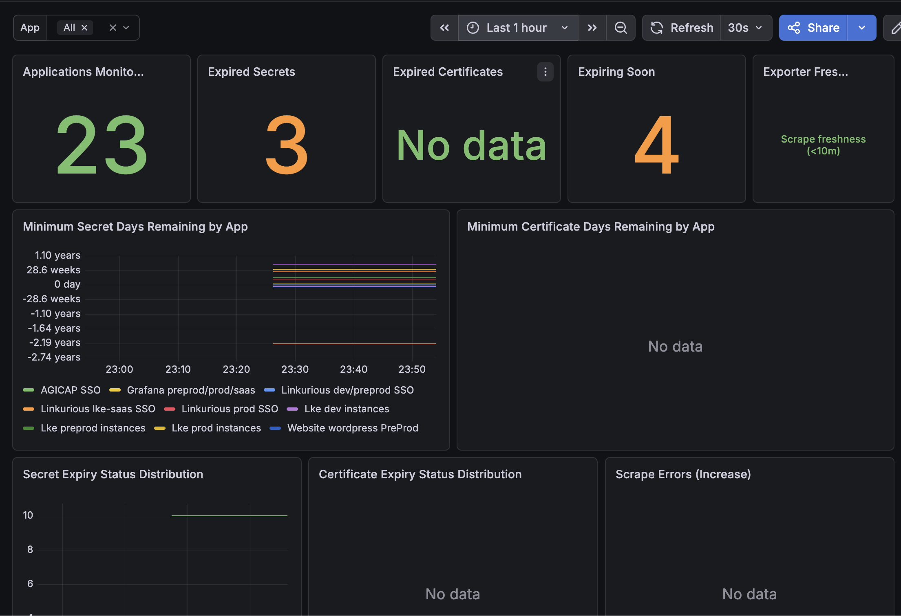

# entra-app-exporter

A Helm chart for the **Entra App Exporter** — a Prometheus exporter that surfaces Azure Entra (formerly Azure AD / Azure Active Directory) application registration details, including client secret and certificate expiration metrics.

## Introduction

The Entra App Exporter connects to the Microsoft Graph API and periodically collects information about all Azure Entra application registrations in your tenant. It exposes Prometheus-compatible metrics that allow you to alert when client secrets or certificates are about to expire.

The application is written in TypeScript and runs as a single stateless pod.

## Prerequisites

- Kubernetes 1.24+
- Helm 3.9+
- An Azure Entra application registration with the `Application.Read.All` Microsoft Graph API permission (application permission, not delegated)
  - **Client credentials** (service principal): `AZURE_TENANT_ID`, `AZURE_CLIENT_ID`, `AZURE_CLIENT_SECRET`
  - **Managed Identity** (Workload Identity / pod identity): requires `azure.useManagedIdentity: true` and proper identity binding

## Installing the Chart

```bash
helm repo add enys-charts https://enys.github.io/helm-charts
helm repo update

helm install entra-app-exporter enys-charts/entra-app-exporter \
  --set azure.tenantId=<TENANT_ID> \
  --set azure.clientId=<CLIENT_ID> \
  --set azure.clientSecret=<CLIENT_SECRET>
```

### Using an existing secret

To avoid placing credentials in `values.yaml`, create a Kubernetes secret first:

```bash
kubectl create secret generic my-entra-credentials \
  --from-literal=AZURE_TENANT_ID=<TENANT_ID> \
  --from-literal=AZURE_CLIENT_ID=<CLIENT_ID> \
  --from-literal=AZURE_CLIENT_SECRET=<CLIENT_SECRET>
```

Then install the chart referencing the existing secret:

```bash
helm install entra-app-exporter enys-charts/entra-app-exporter \
  --set azure.existingSecret=my-entra-credentials
```

### Using Managed Identity (Azure Workload Identity)

```bash
helm install entra-app-exporter enys-charts/entra-app-exporter \
  --set azure.tenantId=<TENANT_ID> \
  --set azure.clientId=<MANAGED_IDENTITY_CLIENT_ID> \
  --set azure.useManagedIdentity=true \
  --set serviceAccount.annotations."azure\.workload\.identity/client-id"=<MANAGED_IDENTITY_CLIENT_ID>
```

## Uninstalling the Chart

```bash
helm uninstall entra-app-exporter
```

## Configuration

The following table lists the configurable parameters.

| Parameter | Description | Default |
|-----------|-------------|---------|
| `replicaCount` | Number of pod replicas | `1` |
| `image.repository` | Container image repository | `ghcr.io/enys/entra-app-exporter` |
| `image.tag` | Image tag (defaults to chart `appVersion`) | `""` |
| `image.pullPolicy` | Image pull policy | `IfNotPresent` |
| `imagePullSecrets` | List of image pull secrets | `[]` |
| `nameOverride` | Override chart name | `""` |
| `fullnameOverride` | Override full release name | `""` |
| `serviceAccount.create` | Create a service account | `true` |
| `serviceAccount.annotations` | Service account annotations | `{}` |
| `podAnnotations` | Extra pod annotations | `{}` |
| `podLabels` | Extra pod labels | `{}` |
| `podSecurityContext` | Pod-level security context | see `values.yaml` |
| `securityContext` | Container-level security context | see `values.yaml` |
| `service.type` | Service type | `ClusterIP` |
| `service.port` | Service port | `9090` |
| `exporter.port` | Container port for the metrics server | `9090` |
| `exporter.scrapeIntervalSeconds` | Interval between Graph API polls (seconds) | `300` |
| `azure.tenantId` | Azure tenant ID (**required**) | `""` |
| `azure.clientId` | Azure client ID | `""` |
| `azure.clientSecret` | Azure client secret | `""` |
| `azure.useManagedIdentity` | Use Managed Identity authentication | `false` |
| `azure.existingSecret` | Name of an existing secret with Azure credentials | `""` |
| `resources` | CPU/memory resource requests and limits | see `values.yaml` |
| `autoscaling.enabled` | Enable HPA | `false` |
| `serviceMonitor.enabled` | Create a Prometheus Operator ServiceMonitor | `false` |
| `serviceMonitor.namespace` | Namespace where the ServiceMonitor is created (defaults to release namespace) | `""` |
| `serviceMonitor.targetNamespace` | Namespace containing the exporter Service to scrape (defaults to release namespace) | `""` |
| `serviceMonitor.interval` | ServiceMonitor scrape interval | `60s` |
| `serviceMonitor.scrapeTimeout` | ServiceMonitor scrape timeout | `30s` |
| `serviceMonitor.path` | Metrics path scraped by ServiceMonitor endpoint | `/metrics` |
| `serviceMonitor.port` | Service port name scraped by ServiceMonitor endpoint | `http` |
| `serviceMonitor.scheme` | ServiceMonitor endpoint scheme | `http` |
| `serviceMonitor.labels` | Extra labels added to the ServiceMonitor | `{}` |
| `serviceMonitor.annotations` | Extra annotations added to the ServiceMonitor | `{}` |
| `serviceMonitor.honorLabels` | Preserve scraped target labels | `false` |
| `networkPolicy.enabled` | Create a NetworkPolicy | `false` |
| `nodeSelector` | Node selector | `{}` |
| `tolerations` | Pod tolerations | `[]` |
| `affinity` | Pod affinity rules | `{}` |

## Exposed Metrics

| Metric name | Type | Description |
|-------------|------|-------------|
| `entra_app_secret_days_remaining` | Gauge | Days until a client secret expires. Negative = already expired. Labels: `app_name`, `app_id`, `secret_name`, `key_id` |
| `entra_app_certificate_days_remaining` | Gauge | Days until a certificate expires. Negative = already expired. Labels: `app_name`, `app_id`, `cert_name`, `key_id`, `cert_type` |
| `entra_app_secret_expiry_info` | Gauge (info) | Info gauge for secrets. Status label values: `ok` (>30d), `warning` (≤30d), `critical` (≤7d), `expired` (<0d), `no_expiry`. |
| `entra_app_certificate_expiry_info` | Gauge (info) | Info gauge for certificates. Same status labels as above. |
| `entra_app_info` | Gauge (info) | General info per app registration. Labels: `app_name`, `app_id`, `object_id` |
| `entra_app_exporter_scrape_errors_total` | Counter | Total errors encountered during Graph API scrapes |
| `entra_app_exporter_last_scrape_timestamp_seconds` | Gauge | Unix timestamp of last successful scrape |

## Grafana Dashboard

A ready-to-import Grafana dashboard is provided at:

`charts/entra-app-exporter/dashboards/entra-app-exporter-overview.json`

It includes:
- app-level overview (apps monitored, expired secrets/certs, scrape freshness)
- minimum secret/certificate lifetime per app
- expiry status distribution (`ok`, `warning`, `critical`, `expired`, `no_expiry`)
- scrape error trend

### Dashboard Preview



## Example Prometheus Alert Rules

```yaml
groups:
  - name: entra-app-exporter
    rules:
      - alert: EntraAppSecretExpired
        expr: entra_app_secret_days_remaining < 0
        for: 1m
        labels:
          severity: critical
        annotations:
          summary: "Azure Entra app secret has expired"
          description: "App {{ $labels.app_name }} secret {{ $labels.secret_name }} expired {{ $value | abs }} days ago."

      - alert: EntraAppSecretExpiringCritical
        expr: entra_app_secret_days_remaining >= 0 and entra_app_secret_days_remaining <= 7
        for: 1m
        labels:
          severity: critical
        annotations:
          summary: "Azure Entra app secret expiring in ≤7 days"
          description: "App {{ $labels.app_name }} secret {{ $labels.secret_name }} expires in {{ $value }} days."

      - alert: EntraAppSecretExpiringWarning
        expr: entra_app_secret_days_remaining > 7 and entra_app_secret_days_remaining <= 30
        for: 1m
        labels:
          severity: warning
        annotations:
          summary: "Azure Entra app secret expiring in ≤30 days"
          description: "App {{ $labels.app_name }} secret {{ $labels.secret_name }} expires in {{ $value }} days."
```

## Azure Permissions

The service principal or managed identity used by the exporter requires the following Microsoft Graph API **application permission**:

| Permission | Type | Description |
|-----------|------|-------------|
| `Application.Read.All` | Application | Read all applications |

Grant admin consent in the Azure portal under **Azure Entra ID → App registrations → API permissions**.

## Source Code

The TypeScript source for this exporter is located in [`apps/entra-app-exporter/`](../../apps/entra-app-exporter).
